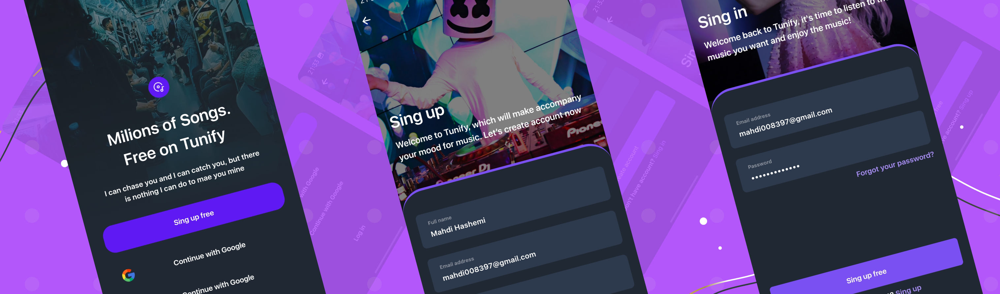
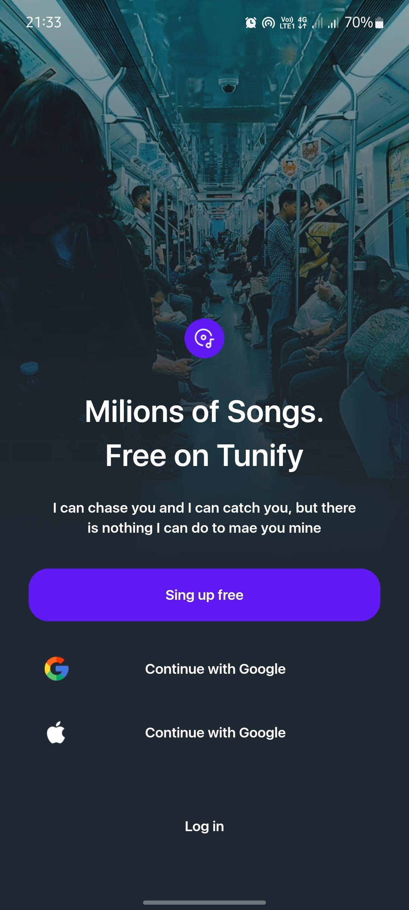
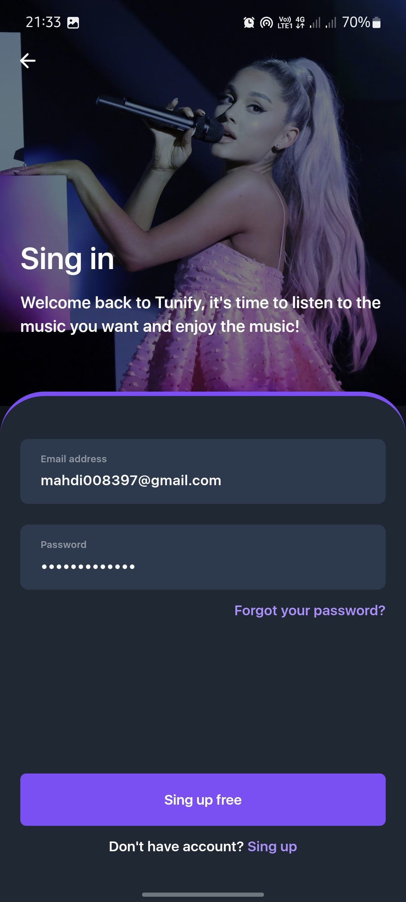
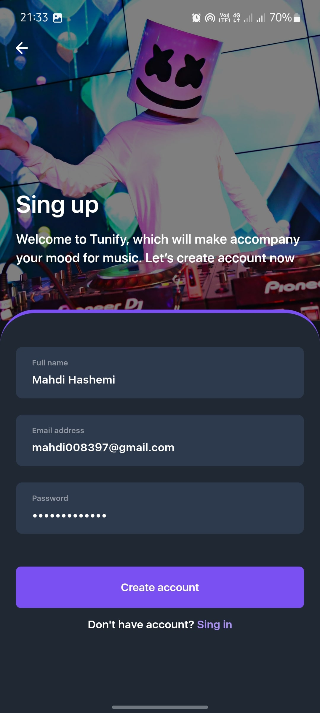

# The Modern Login Template

<p float="left">
  
</p>

## Description

Login Modern is a small project in which we implemented three pages of a music application. This project was created solely for the purpose of practicing UI implementation. If you notice any problems with the design or coding, please feel free to contact me.

<!-- ### Download Demo App
[Demo App Android](https://example.com/) -->

## Screenshots

<p float="left">
  
  
  
  [](Demo.mp4 "Demo")
</p>

## Dependencies

### Vieo Player

- video_player: ^2.9.1

<br>

### Getting Started

```shel
git clone git@github.com:mahdi008397/Login_Modern.git
cd login_modern
flutter create . --platforms=linux,android
flutter pub get
flutter run
```

## Links

Support me on Instagram. ❤️

- [Instagram](https://instagram.com/M_programmer_H)
- [Telegram](https://t.me/M_programmer_H)
